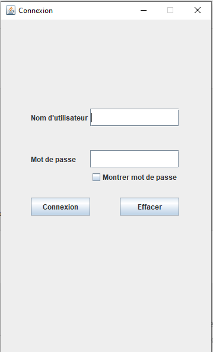
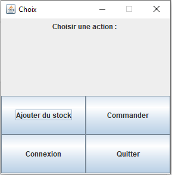
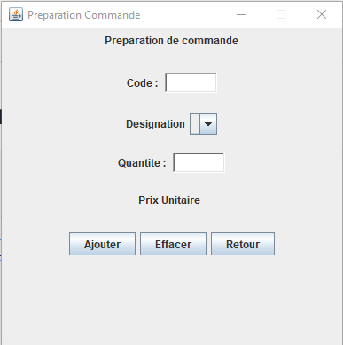
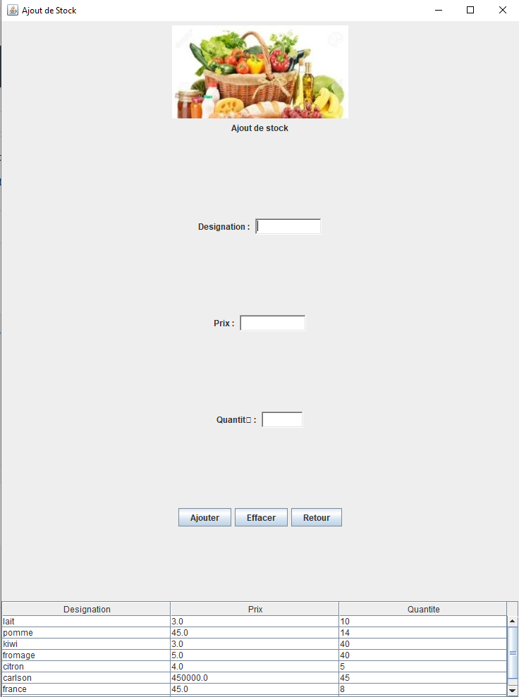

# Gestion d'un stock de produits dans un magasin

L'application permet de developper une application Swing 3 couches (MVC) permettant la gestion d'un stock de produits dans un magasin.

# Création d'une connexion avec le nom d'utilisateur et le mot de passe

# Création de 4 boutons pour choisir une action

# Création de la préparation de commande

# Création d'un ajout de Stock

# Équipe
Rayan Kharroubi

